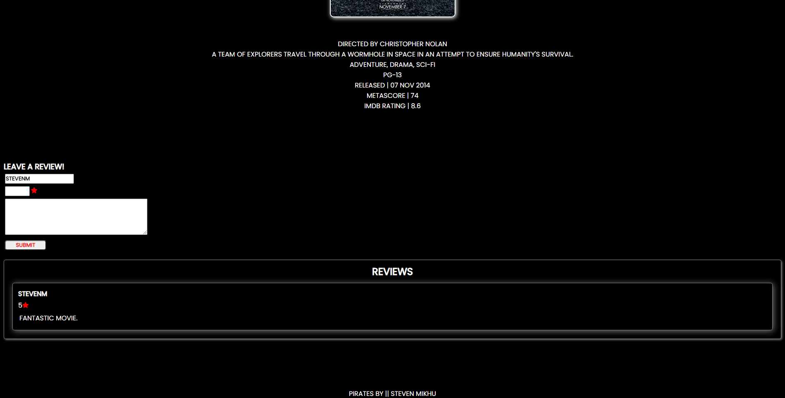

<h1>Pirates</h1>

<h2>App Description</h2>
<h4>An app where you can search for movies, view a full description on them and add them to your favorites/to watch list.</h4>

<h2>User Stories</h2>
<ul>
  <li>AAU, I want to be able to create and log into my own account.</li>
  <li>AAU, I want to be able to add a movie to the list and view the movies everyone else adds as well.</li>
  <li>AAU, I want to be able to view a description of a movie.</li>
  <li>AAU, I want to be able to rate a movie as well as leave a comment on the movie.</li>
  <li>AAU, I want to be able to create my own favorites list and add and remove movies to my own personal list.</li>
</ul>

<h2>Technologies Used</h2>
<ul>
  <li>HTML</li>
  <li>CSS</li>
  <li>Python</li>
  <li>Django</li>
  <li>PostgreSQL</li>
</ul>

<h2>Wireframe</h2>

<h2>App Images</h2>
<h4>Desktop</h4>

<h4>Mobile</h4>

<h2>Live App Link</h2>
https://pirates-project.herokuapp.com/

<h2>Future Enhancements</h2>
<ul>
  <li>API integration</li>
  <li>Add section for shows/documentaries</li>
  <li>Separate movies/shows by genre</li>  
  <li>Ability to delete/edit comments</li>
  <li>Redesigned rating system</li>  
</ul>

